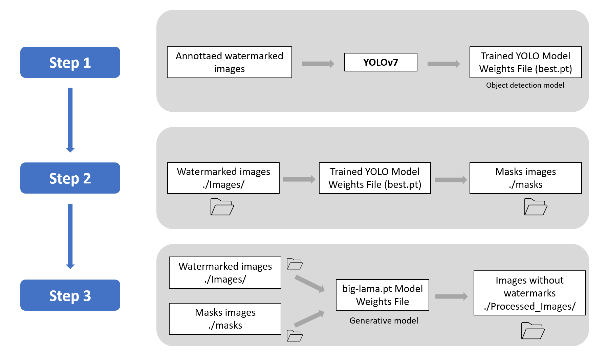

# Watermark removal from images

## Description
This project is designed to remove watermarks from images by detecting them using YOLOv7, a state-of-the-art object detection model, and then using a generative AI model to seamlessly replace the detected watermarks with the appropriate content.

## Features
- **Watermark Detection**: Utilizes YOLOv7, a cutting-edge object detection model, to accurately identify watermarks in images.
- **Generative AI Replacement**: Seamlessly removes detected watermarks and fills in the gaps using a generative AI model, ensuring the content and quality of the image are preserved.
- **Batch Processing**: Supports processing multiple images in a batch, making it efficient for large-scale tasks.


## Prerequisites
Before you begin, ensure you have met the following requirements:
- You have installed `Python 3.10`.
- You have a `Linux` system.

## Installation

### 1. Clone the repository
```bash
git clone https://github.com/WongKinYiu/yolov7.git

cd yolov7

pip install -r requirements.txt

cd ..

git clone https://github.com/aryadytm/remove-photo-object.git

cd remove-photo-object

pip install -r requirements.txt

cd assets
rm -r big-lama.pt
wget https://huggingface.co/spaces/aryadytm/remove-photo-object/resolve/main/assets/big-lama.pt

cd ../..

```

`big-lama.pt` is based on the Resolution-robust Large Mask Inpainting with Fourier Convolutions model weights file from https://github.com/advimman/lama

### 2. Prepare your images in the root folder

Place all the images from which you want to remove watermarks into a folder named `Images` located in the root directory of this project.

Ensure the folder is correctly named `Images`

### 3. Run Step 2


```bash
pyhton step_2.py
```

If the process is expected to take a long time and you want it to continue running in the background, you can use nohup:

```bash
nohup pyhton step_2.py &
```
This will allow the pipeline to run uninterrupted, even if you close the terminal session.

### 4. Run Step 3

Before running the following, if you have a gpu, we advisee you to go to src/core.py and replace "cpu" by "cuda" as follow :

```bash
device = torch.device("cpu")
model = torch.jit.load(model_path, map_location="cpu")
```

to :
```bash
device = torch.device("cuda")
model = torch.jit.load(model_path, map_location="cuda")
```

```bash

mv step_3.py remove-photo-object/

cd remove-photo-object/

nohup pyhton step_3.py &
```


### 4. Accessing the Processed Images

After the script completes, you will find your files with the watermarks removed in the Processed_Images folder.


## Pipeline Overview

Below is a schema outlining the process used to remove watermarks from images. This pipeline integrates YOLOv7 for watermark detection and a generative AI model for seamless watermark removal. It ensures high-quality results while maintaining the integrity of the original images.




## Remarks

### 1. YOLOv7 Model Limitations:

The best.pt file provided in this project is specifically trained to detect and remove a particular type of watermark. It will work effectively only on images containing watermarks similar to those it was trained on.

### 2. Handling New Watermarks:

If you need to process images with different types of watermarks, it's necessary to retrain the YOLOv7 model. This involves annotating around 400 images with the new watermark and then using these annotations to retrain the model. Retraining will ensure that the model accurately detects and removes the new watermark from the images.


